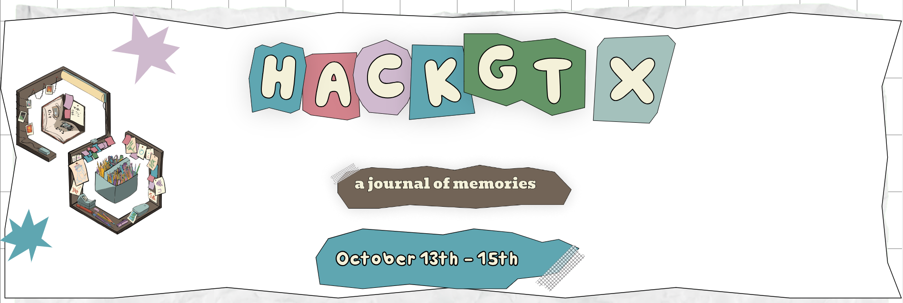

# HackGT Plot Visualize & Analysis Project



Welcome to the repository for our HackGT Plot Analysis Project! This project is part of HackGT and is scheduled to start on October 13th.

## Project Overview

The main goal of this project is to develop a comprehensive tool for analyzing and visualizing various types of plots and data series. The project is divided into three main components:

**1. Plot Classification**

We fine-tuned a transformer-based classifier to ascertain whether an image provided by the user contains a valid plot. If the image is confirmed as a valid plot, we then utilize another fine-tuned classifier to identify the specific type of plot it represents. We've included twenty diverse images of various types in the `test_images` directory for you to experiment with, assessing the accuracy of both classification models.
Data Series Analysis

**2. Data Series Analysis**

We fine-tuned the Yolox7 model to create our object detection system for detecting the x and y labels within a plot, as well as all the data points contained in the plot.
Additionally, we fine-tuned the EasyOCR model using an RNN+LSTM architecture, enhancing its ability to recognize text in complex scenarios, such as tilted text, numbers with decimal points, and blurred text.

**3. Web-Based Visualization**

Finally, we perform data series interpolation based on the outcomes from the first two steps. For the creation of our web application, we employed Flask as the backend framework and HTML/CSS for the frontend design.

## Getting Started

Clone the repository to your local machine:
   ```shell
   git clone https://github.com/qzheng75/Visualize_Plots_dev.git
   ```
Run the current version of the web app:
   ```shell
   python run.py
   ```

## Datasets involved in this project
- The plots utilized for training the plot classification network and fine-tuning Yolox7 can be found at this Kaggle competition link: Benetech Making Graphs Accessible.
- The datasets employed in training the is-plot-or-not network include:
   - The plot dataset mentioned above.
   - Icons-50 dataset: Icons-50.
   - Handwritten math symbols dataset: Handwritten Math Symbols.
   - A subset (selected due to computational resource limitations) of the COCO 2017 dataset: COCO 2017 Subset.
- The dataset used for fine-tuning the OCR model was generated by extracting components labeled by annotations from the plot dataset.
